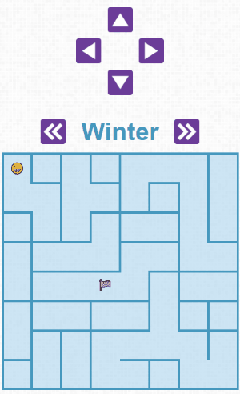

# Maze of Seasons
Navigate through a randomly generated multi-level maze towards your goal (the checkered flag). When you hit a wall, change the season.

## Gameplay
Here's what it's like to play the game (fast-forwarded quite a bit):



On desktop there's some keyboard shortcuts (hidden by CSS until the screen is large enough)... alo, keypress events are *so cool*.

## The code
I wrote almost everything in TypeScript - it's easier for debugging than JavaScript, and static types are wonderful. 

There's a bit of jQuery in the display and character classes; I could have just used DOM directly, but I wanted some practice with jQuery. Since I've gotten that practice, I'll probably convert the jQuery stuff into vanilla javascript.

This was my first time using CSS Grids to handle the layout (definitely using them again).

## Growing Tree Algorithm
I needed a bit of mental gymnastics to get my head around the growing tree algorithm. It's a method of creating a maze out of a grid. Here's the steps.

### 1. Create a multi-level array (a grid)
My grid:
- `z`: 4 (levels/seasons)
- `y`: 8 cells (rows)
- `x`: 8 cells (columns)

Each cell is an object from the `Cell` class.

Cells have cardinal directions (`North`, `South`, `East`, `West`, `Up` a layer, `Down` a layer). Those directions can be `true` or `false`.
- `true`: indicates a path that direction
- `false`: indicates a wall that direction

For details on each class see the [build/maze.d.ts](https://github.com/alexkadis/maze-game/blob/master/build/maze.d.ts) file.

### 2. Create a temporary cell stack to hold the cells as you create them
As a cell is created, it's added to the stack, before the end of this process, it'll be removed.

For this project, I used an array as JavaScript and TypeScript don't explicitly have stacks.

### 3. Choose a starting point on the grid
I used `z:0 y:0 x:0`.

### 4. Choose a direction at random
`North`, `South`, `East`, `West`, `Up` a layer, `Down` a layer

If you can't go that way, (the cell is already full) choose a different direction.

### 5. Once you find a direction you can go:
- Add it to the stack of cells.
- Add the cell to the grid.
- Set the current cell's direction to true and the next cell's reverse direction to true

e.g.: 
```
Cell#1
location:	grid[0]0][0] -> grid[z][y][x]
North:	false
South:	false
East:	false
West:	false
Up:	false
Down:	false

// direction chosen: South
// Every false will become a wall if it doesn't eventually point at a cell

Cell#1:
location:	 grid[0][0][0]
North:	false
South:	true
East:	false
West:	false
Up:	false
Down:	false

Cell#2:
location:	 grid[0][1][0]
North:	true
South:	false
East:	false
West:	false
Up:	false
Down:	false
```


### 6. Keep going until you can't move in any direction
All of the directions have cells in them.

### 7. Backtrack until you can go another direction
To backtrack, we pop the last cell off the cell stack and start the process over at step 4.


### 8. Repeat steps 4-7 until you've filled the entire maze
The number of cells left on the stack will be zero (we backtracked all the way to the beginning.)

See links in [Credits](#credits) to Jamis Buck's work for more details.

## Display
### 1. Loop through the multi-layer array (the grid)
`// grid[z][y][x] = grid[layer][row][column]`
### 2. If a direction is false, set that border wall
In CSS parlance: top border, east border, south border, west border

```
location:	grid[0]0][0]
North:	false	= border top
South:	true	= transparent border (a path)
East:	false	= border right
West:	false	= border bottom
Up:	false
Down:	false
```

Up and Down aren't used for display in my maze.

## TO DO
### Re-design in canvas?
Might want to go to using canvas and making it look *good*.

## Check out Localstorage to hold proceedural mazes?

## Credits
This project would not be possible without [Jamis Buck](https://github.com/jamis) and his posts on [Maze Generation: Growing Tree algorithm](http://weblog.jamisbuck.org/2011/1/27/maze-generation-growing-tree-algorithm) and [Minecraft Maze Generator](http://jamisbuck.org/mazes/minecraft.html). My algorithmic and display code borrows heavily from his, and lessons learned in his blog posts.

The icons are from [Vecteezy](https://www.vecteezy.com/), go check them out.
